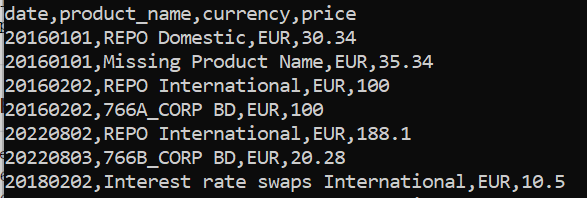

Enrich Trade Data API
================================================================================================

Overview
================================================================================================
This maven project is created to expose an API to enrich trade data by translating the product id
to its corresponding product name. This project comprises of only one POST method and it is build
on micronaut framework and Java 17.

How Does It Works?
================================================================================================
The service will first load the content of product.csv into the key value pair hashmap that will
aid the searches later on upon starting of server. This is a static data file (product.csv) located 
at src/main/resources. There is also another data file called invalid_product.csv that will be use
in the test for invalid data line scenario.

Static Data File
================================================================================================
In order to update to a bigger product data file, you are free to create and replace the 
product.csv located at src/main/resources with a new one. Please note that the service is expecting
data line in following format product_id,product_name. Any format other than this will not be load
to memory and therefore will result to "Missing Product Name" later during data enrichment. You 
can replace invalid_product as you wish as well.

How to run?
================================================================================================
1) Download the code or clone it from github and open it on ide of your choice e.g. intellij/
eclipse.
   - Build and run the application.
   - The server should indicate "Startup completed"
2) Generate the executable jar on intellij by the following steps:
   - Go to File -> Project Structure and click on the + 
   - Select JAR -> From modules with dependencies.. and new window will pop up
   - Select the main application, wilson.coding.task.Application in the Main Class field and
     {project root dir}\src\main\resources on the Directory for META-INF/MANIFEST.MF and click OK.
   - Select the Output Directory to {project root dir}\target, default directory or directory of 
     your choice and click OK.
   - Go to Build -> Build Artifacts -> Build
   - You should see the jar file specified in the Output Directory earlier.
   - Go to cmd/terminal and fire the following command => java -jar {jarfile.jar}
   - Server should indicate as "Startup completed"
   
Sending HTTP Request
================================================================================================
Once the server is up and running, you may fire request to Enhance Trade Data API with the
following ways:
1) cmd/terminal
   - Enter following command:
     curl --request POST --data-binary @trade.csv --header "Content-Type: text/csv" 
     --header "Accept: text/csv" http://localhost:8080/enrich
   - Things to note, make sure the data file (trade.csv) is present in the current directory where you
     run the command and use --data-binary instead of --data. This is because curl will remove the
     new line character and our service is taking the request body as a single string thus
     causing unwanted issue.
2) Postman
   - Select POST method and enter the endpoint, localhost:8080/enrich
   - Add Content-Type = text/csv in the headers
   - Select Body -> raw and copy the content of trade.csv to the blank space and press SEND.
   
Trade Data file and HTTP response
================================================================================================
You can generate your own trade input file and following is the sample content of trade file:

date,product_id,currency,price
20160101,1,EUR,10.0 
20160101,2,EUR,20.1 
20160101,3,EUR,30.34 
20160101,11,EUR,35.34

Note that invalid trade data e.g. 20160101,11,EUR,35.34,test1,test2 will be discarded before further
processing.

And sample HTTP response:

Note that invalid product id resulted to "Missing Product Name" being return.

Port
================================================================================================
The server will run on default port 8080.

Log
================================================================================================
The server will error logged invalid date format to both console and file. The log file is located
at \EnrichTradeData.log

It will also WARN logged for following scenarios:
    -invalid product data line.
    -Product name not found while translating product id to product name.

Logger configuration is located at src\main\resources\logback.xml

Assumption
================================================================================================
Data in product.csv and the input file, trade.csv are in correct format as described below:

1) product.csv
   - contains header; product_id,product_name
   - contains data line(s) correspond to 2 fields above
2) trade.csv
   - contains header; date,product_id,currency,price
   - contains data line(s) correspond to 4 fields above
   - date field is in correct format - yyyyMMdd
   
NOTE that data/input that doesn't conform to the above assumption might cause unintended issue
with the service/unexpected outcome or response/logged/omitted in the http response.
